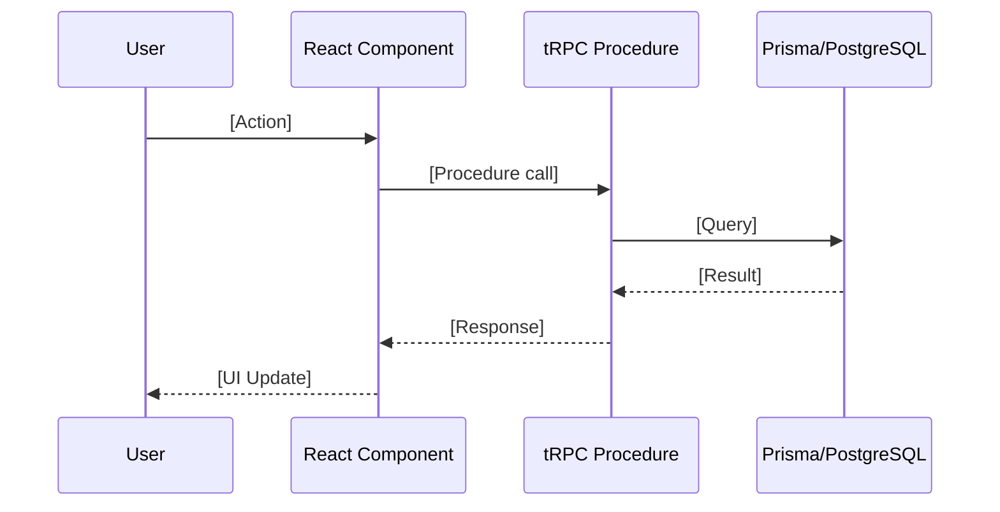
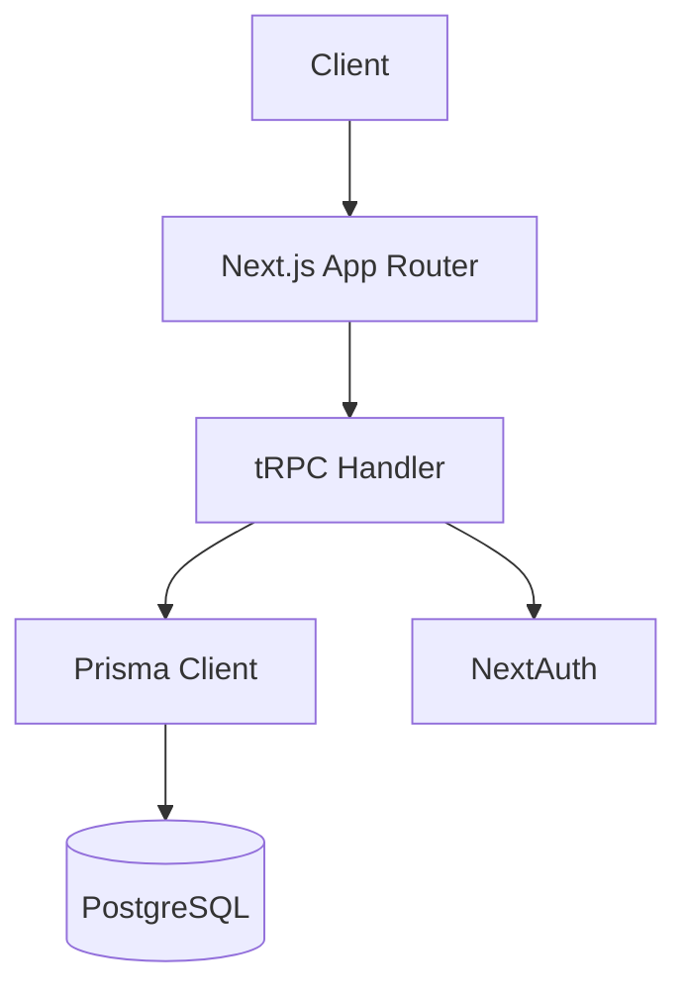

# Code Explanation Skill

Generate clear, comprehensive explanations of code and architecture for developers.

## Capabilities

- **Code Walkthroughs**: Explain what code does and why
- **Data Flow Tracing**: Follow data from UI to database and back
- **Architecture Overviews**: Explain system structure and patterns
- **Pattern Identification**: Identify and explain design patterns used
- **Decision Documentation**: Explain implicit "why" behind code decisions

## Explanation Types

### Code Explanation
For explaining specific code sections:

```markdown
## Explanation: [File/Function Name]

### Purpose
[One sentence describing what this code does]

### How It Works
1. [Step-by-step breakdown]
2. [Each significant operation]
3. [With context for why]

### Key Concepts
- **[Concept]**: [Brief explanation]

### Dependencies
- Uses: [What it imports/depends on]
- Used by: [What calls/imports this]

### Example Usage
```typescript
// How to use this code
```
```

### Data Flow Trace
For understanding how data moves through the system:

```markdown
## Data Flow: [Feature/Action Name]

### Overview
[Brief description of the user action and resulting data flow]

### Flow Diagram


### Step-by-Step

1. **User Action** (`src/app/page.tsx:42`)
   - User clicks/submits/etc.
   - Triggers: `api.router.procedure.useMutation()`

2. **API Layer** (`src/server/api/routers/example.ts:15`)
   - Validates input with Zod
   - Checks authorization
   - Calls database

3. **Database** (`prisma/schema.prisma`)
   - Tables involved: [list]
   - Operations: [SELECT/INSERT/UPDATE]

4. **Response**
   - Data returned to client
   - UI state updated via React Query
```

### Architecture Overview
For explaining system design:

```markdown
## Architecture: [System/Feature]

### Overview
[High-level description]

### Diagram


### Components

| Component | Location | Responsibility |
|-----------|----------|----------------|
| [Name] | [Path] | [What it does] |

### Patterns Used
- **[Pattern Name]**: [How it's applied here]

### Trade-offs
- **Chose X over Y because**: [Reasoning]
```

## Explanation Guidelines

### Be Concise But Complete
- Start with the "what" (purpose)
- Follow with the "how" (mechanism)
- End with the "why" (reasoning)

### Use Diagrams When Helpful
- Sequence diagrams for flows
- Component diagrams for architecture
- State diagrams for complex logic

### Link to Source
- Always reference specific files and line numbers
- Format: `src/path/file.ts:42`

### Target Audience
- Assume TypeScript/React familiarity
- Explain project-specific patterns
- Don't over-explain standard patterns
